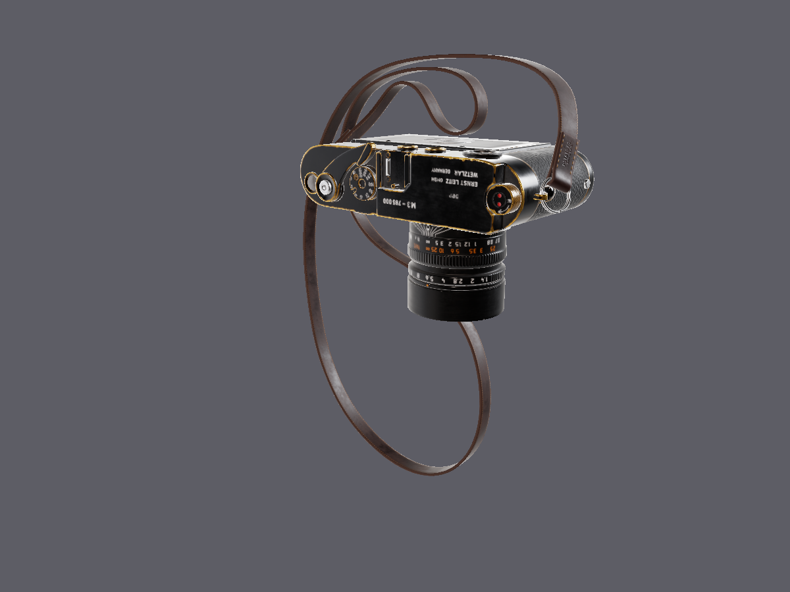
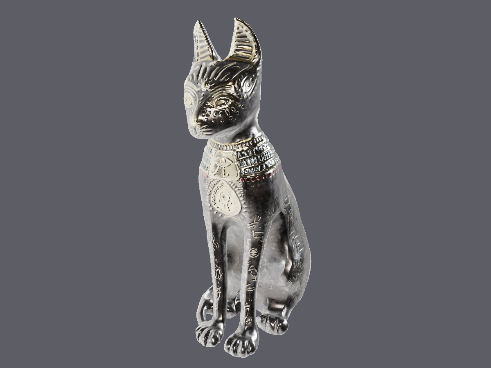
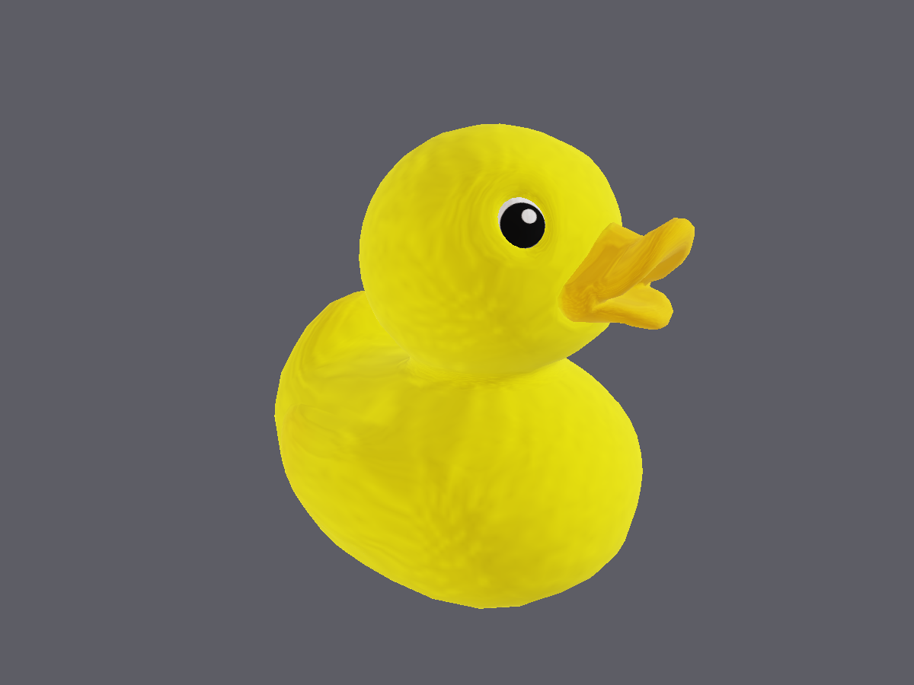
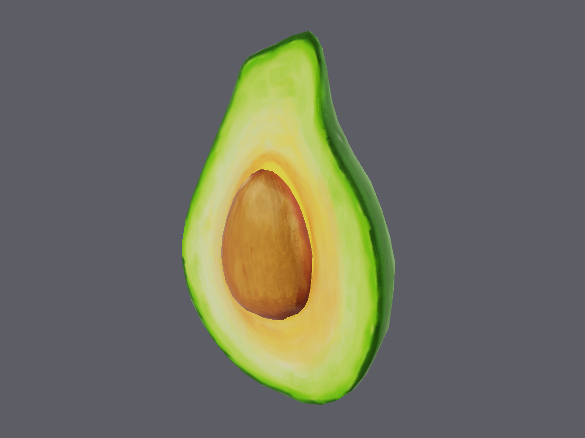

# MetalMesh

Metal 3 **메시 셰이더**(object → mesh → fragment)로 3D 모델을 렌더링하는 iOS / macOS 뷰어입니다.
모델 파일을 CPU에서 메시렛(meshlet)으로 나눠 GPU에 올리고, object 스테이지에서 메시렛 단위 프러스텀·노멀 콘 컬링을 한 뒤
mesh 스테이지가 살아남은 메시렛만 삼각형으로 펼칩니다.

> A SwiftUI + Metal 3 mesh-shader viewer for iOS/macOS. Models are split into meshlets on the CPU,
> culled per-meshlet in the object stage (frustum + normal cone), and expanded in the mesh stage.

| 셰이딩 | 메시렛 시각화 |
|---|---|
|  |  |
|  사자 석상, 49만 삼각형 (CC0, noe-3d.at) |  XYZ RGB Dragon, 25만 삼각형 → 11,900 메시렛 |
|  노멀 디버그 뷰 (Cleveland Museum of Art, CC0) |  와이어프레임 |
|  baseColor 텍스처 (Poly Haven Camera 01, CC0) |  USDZ 내장 텍스처 (Egyptian Cat Statue by Ankledot, CC BY) |
|  GLB (Khronos Duck) |  GLB PBR 재질 + IBL (Khronos Avocado, CC0) |

이미지는 앱의 렌더러로 오프스크린 렌더링한 결과입니다 (`Tests/SnapshotTests.swift`).

## 기능

- **모델 라이브러리** 화면: 번들 샘플 25개 자동 등록, 파일 임포터·드래그&드롭으로 추가, 재시작 후에도 유지,
  항목별 썸네일(오프스크린 렌더, Documents/Thumbnails에 PNG 캐시)
- **뷰어** 화면: 트랙볼 카메라(회전/줌/팬, 짐벌 락 없음), 표시 모드(셰이딩·메시렛 색·노멀), 컬링·오클루전·와이어프레임·텍스처 토글, 라이선스 정보 시트
- **메시렛 컬링 3단**: 프러스텀(경계 구) → 노멀 콘(뒷면) → 2패스 Hi-Z 오클루전. 하단 통계 바에 그린/전체/가림 수와 GPU 시간 표시
- **PBR(metallic-roughness) + IBL**: baseColor·노멀·러프니스·메탈릭 맵을 OBJ(.mtl), USDC, USDZ(내장), glTF 재질에서 추출.
  HDRI(Poly Haven CC0)로 조도 큐브맵·GGX 프리필터 스펙큘러·BRDF LUT를 시작 시 컴퓨트로 생성해 Cook-Torrance 셰이딩, ACES 톤매핑.
  서브메시별 재질을 메시렛 단위로 유지하고 Metal 3 인자 버퍼(`MTLResourceID`)로 프래그먼트에서 직접 샘플링
- 하단 통계: 보이는 메시렛 / 전체 메시렛, 삼각형 수, GPU 프레임 시간
- 지원 포맷: **OBJ, PLY, STL, USD / USDA / USDC / USDZ** (Model I/O), **GLB / glTF** (자체 최소 로더: 노드 변환, 인덱스 유무,
  TRIANGLES/STRIP/FAN, 정규화 정수 접근자, 내장·외부·data: URI 텍스처. Draco·스키닝·애니메이션은 미지원)

## 렌더링 파이프라인

```
파일 ──▶ ModelLoader (Model I/O)      삼각형화, 노드 변환 적용, 노멀 생성, Vertex{pos,normal,uv} 48B로 정규화
         GLBLoader (glb/gltf)          같은 MeshData를 만드는 자체 glTF 2.0 파서
                                      서브메시 재질에서 baseColor 텍스처/색 추출, 삼각형별 재질 인덱스
     ──▶ MeshPostProcess              정점 용접(Model I/O가 면마다 쪼갠 정점 복원), 노멀 없으면 면적 가중 스무스 노멀, UV 기반 탄젠트
     ──▶ MeshletBuilder (CPU)         인접 삼각형을 정점 재사용·노멀 정렬·거리 점수로 골라 키우는 클러스터링
                                      (meshoptimizer 방식 단순화, 재질별 분리) → 정점 ≤64 / 삼각형 ≤126
                                      메시렛마다 경계 구 + 노멀 콘(meshoptimizer 규약) + 재질 인덱스
     ──▶ GPUMesh                      vertices / meshlets / meshletVertices / meshletTriangles 버퍼
                                      텍스처(sRGB, 밉맵) + Material 인자 버퍼(리소스 ID)
     ──▶ drawMeshThreadgroups
            object 스테이지  스레드 1개 = 메시렛 1개. 프러스텀·콘·Hi-Z 오클루전 컬링 → 살아남은 인덱스를 페이로드에 압축
                             set_threadgroups_per_grid(살아남은 수), atomic 카운터로 통계
            mesh 스테이지    스레드그룹 1개 = 메시렛 1개. set_vertex / set_index / set_primitive(meshletID)
            fragment         Material[materialIndex] PBR 샘플링(노멀 맵은 정점 탄젠트), IBL(조도+프리필터 스펙큘러+BRDF LUT), ACES
```

Swift와 MSL은 `MeshCore/include/ShaderTypes.h` 한 파일에서 `Vertex`, `Meshlet`, `Uniforms`, 버퍼 인덱스를 공유합니다.
레이아웃은 `Tests/ShaderTypesTests.swift`가 고정합니다.

메시 처리 코드(로더, 메시렛 빌더, 수학)는 **MeshCore 프레임워크**로 분리되어 Debug 구성에서도 `-O`로 빌드됩니다.
`-Onone`에서는 클러스터링이 약 50배 느려(bunny 2.1s vs 40ms) 뷰어 로딩과 썸네일 생성이 체감될 정도로 지연되기 때문입니다.
앱 본체는 `-Onone`이라 그대로 디버깅할 수 있습니다.

### 2패스 Hi-Z 오클루전 컬링

```
1패스  지난 프레임에 보였던 메시렛만 그린다 (가시성 비트 버퍼)
Hi-Z   깊이 버퍼 → r32Float 밉 피라미드 (컴퓨트, 2×2 max 축소 = 가장 먼 가림막)
2패스  나머지 메시렛의 경계 구 AABB 8꼭짓점을 투영 → 화면 사각형 → 사각형/2 이상 텍셀 밉에서 3×3 샘플
       구의 가장 가까운 깊이 > 샘플 최대 깊이 → 가려짐. 새로 보이는 것만 그리고 가시성 비트 갱신
```

가시성 비트 덕분에 카메라가 움직여도 팝이 없고, 두 패스를 합친 결과는 오클루전 없이 그린 것과 픽셀 단위로 같습니다
(`hiZOcclusionKeepsBunnyImageIdentical` 테스트). 근평면을 걸치는 구는 컬링하지 않습니다.

컬링 효과 (6방향 평균, 128px 타깃 기준. 실제 화면에선 Hi-Z가 더 정밀해 오클루전 효과가 커집니다):

| 모델 | 삼각형 | 메시렛 (스캔 → 클러스터) | 프러스텀+콘 (스캔 → 클러스터) | + Hi-Z 오클루전 | 평균 경계 구 반지름 |
|---|---|---|---|---|---|
| Stanford Bunny | 69k | 882 → 874 | 21% → 33% | 38% | 0.0109 → 0.0067 |
| XYZ RGB Dragon | 250k | 3,220 → 3,181 | 4.6% → 15.4% | 32% | 5.12 → 3.12 |
| Löwe (사자 석상) | 491k | 7,541 → 7,592 | 11.6% → 23.2% | 44% | 3.34 → 2.19 |

## 요구 사항

| 항목 | 값 |
|---|---|
| Xcode | 16 이상 (Xcode 26.6에서 개발) |
| 배포 타깃 | iOS 17 / macOS 14 |
| GPU | Metal 3 + Apple7 패밀리 이상 (A14 / M1 이상). iOS 시뮬레이터는 메시 셰이더 미지원 → 안내 화면 표시 |
| 프로젝트 생성 | [XcodeGen](https://github.com/yonaskolb/XcodeGen) (`brew install xcodegen`) |

## 빌드

```bash
brew install xcodegen
xcodegen generate            # MetalMesh.xcodeproj 생성 (.xcodeproj는 커밋하지 않음)
open MetalMesh.xcodeproj
```

`project.yml`의 `DEVELOPMENT_TEAM`을 본인 팀으로 바꾸면 실기기에 설치할 수 있습니다.

명령줄:

```bash
# macOS 빌드 + 테스트 (59개)
xcodebuild -project MetalMesh.xcodeproj -scheme MetalMesh -destination 'platform=macOS' \
  -derivedDataPath build/DerivedData test

# iOS 기기용 빌드
xcodebuild -project MetalMesh.xcodeproj -scheme MetalMesh -destination 'generic/platform=iOS' \
  -derivedDataPath build/DerivedData -allowProvisioningUpdates build

# README 스크린샷 재생성 → 테스트 호스트 컨테이너의 tmp/snapshots/ 에 PNG 생성
TEST_RUNNER_METALMESH_SNAPSHOTS=1 xcodebuild ... -only-testing:MetalMeshTests/SnapshotTests test
```

## 조작

| 동작 | macOS | iOS |
|---|---|---|
| 회전 | 드래그 | 한 손가락 드래그 |
| 줌 | 스크롤 휠, 트랙패드 핀치 | 핀치 |
| 팬 | 우클릭 드래그, ⌥ + 드래그 | 두 손가락 드래그 |

## 프로젝트 구조

```
project.yml                     XcodeGen 정의 (MeshCore 프레임워크 + iOS/macOS 앱 + 테스트, 모두 멀티플랫폼 단일 타깃)
MeshCore/                       메시 처리 프레임워크 (Debug에서도 -O)
  include/ShaderTypes.h         Swift/MSL 공유 타입 (엄브렐라 MeshCore.h)
  ModelLoader, GLBLoader        Model I/O 로더 / 자체 glTF 로더 → MeshData
  MeshPostProcess               정점 용접, 스무스 노멀
  MeshletBuilder                클러스터·스캔 전략, 경계 구·노멀 콘
  ModelProbe, ModelIOQueue      통계 프로브, Model I/O 직렬화 액터
  Math                          투영/lookAt/프러스텀 평면
MetalMesh/
  App/                          진입점, 기기 지원 검사, 미지원 안내
  Library/                      ModelEntry, ModelLibrary(JSON 인덱스 + Documents/Models), ThumbnailStore, 리스트 화면
  Rendering/                    Renderer(2패스 오클루전, Hi-Z 빌드), GPUMesh(PBR 텍스처), IBLEnvironment(HDRI→IBL 사전계산), Snapshot, Shaders/(MeshShaders, HiZ, IBL)
  Resources/Environment/        HDRI (Poly Haven studio_small_09, CC0)
  Viewer/                       ModelViewerView, MetalView(제스처), OrbitCamera
  Resources/Samples/            번들 샘플 모델 + 폴더별 LICENSE.txt + MODELS.md
Tests/                          Swift Testing 59개 (레이아웃, 라이브러리, 썸네일, 로더·재질, glTF, 메시렛, 오프스크린 렌더)
scripts/probe-model.swift       Model I/O 로드 검증 CLI
scripts/bench-meshlets.swift    메시렛 빌더 벤치마크 (-O CLI)
.claude/skills/fetch-3d-model/  무료 소스(Poly Haven, Sketchfab, Poly Pizza, GitHub 테스트 메시)에서 모델을 받는 절차
PLAN.md                         단계별 계획과 진행 상태
```

## 알아둘 점

- **libusd 동시 로드 크래시**: Apple의 USD 런타임은 여러 스레드에서 USD 파일을 동시에 처음 열면 크래시합니다
  (`Sdf_GetExtension` 널 포인터). 모든 Model I/O 호출은 `ModelIOQueue` 액터로 직렬화합니다.
- Model I/O는 노멀이 없는 OBJ에 `addNormals`를 쓰면 면마다 정점을 쪼갭니다(bunny 35k → 208k 정점). 로더는 대신 정점을 용접하고 스무스 노멀을 직접 계산합니다.
  정점 공유가 없으면 메시렛이 정점 64개 한계에 걸려 삼각형 21개씩만 담기고 인접 기반 클러스터링도 불가능합니다.
- MTKView 깊이 텍스처는 기본적으로 셰이더에서 읽을 수 없어 `depthStencilAttachmentTextureUsage`에 `shaderRead`를 더하고 메모리리스가 아니어야 Hi-Z를 만들 수 있습니다.
- 래스터라이저 컬링은 끄고(`cullMode = .none`) 뒷면 제거는 object 스테이지의 노멀 콘이 담당합니다. 와인딩이 뒤집힌 파일도 보이게 하기 위함입니다.
- USD 재질에는 baseColor 의미 속성이 여러 개일 수 있어(상수 `baseColor` + 텍스처 `diffuseColor`) 텍스처가 있는 쪽을 우선합니다. USDZ 내장 텍스처는 `MDLAsset.loadTextures()` 뒤에만 읽힙니다.
- Model I/O는 Poly Haven usdc의 roughness 텍스처 연결을 놓칩니다(빈 문자열). 로더가 baseColor 파일명 규칙(`_diff_` → `_rough_`/`_metal_`/`_nor_gl_`)으로 이웃 파일을 찾습니다.
- ImageIO는 Poly Haven의 EXR 노멀 맵을 디코딩하지 못해 PNG 버전을 씁니다(`fetch-3d-model` 스킬 참고).
- Model I/O UV는 좌하단 원점이라 셰이더에서 v를 뒤집어 샘플링합니다.
- glTF UV는 좌상단 원점이라 로더에서 v를 뒤집어 내부 규약(좌하단)에 맞춘 뒤 셰이더가 다시 뒤집습니다.
- MTKTextureLoader는 팔레트(인덱스 컬러) PNG를 디코딩하지 못해(Khronos Duck) 업로드 전에 RGBA8로 다시 그립니다.

## 로드맵

- [x] baseColor 텍스처 표시
- [x] 리스트 썸네일(오프스크린 렌더 재사용)
- [x] 삼각형 전용 최소 GLB 로더
- [x] 메시렛 클러스터링 품질 개선(meshoptimizer 방식)
- [x] 2패스 Hi-Z 오클루전 컬링
- [x] PBR + IBL, 노멀 매핑
- [ ] 클러스터 LOD (Nanite식)
- [ ] MetalFX 업스케일링, MSAA
- [ ] 그림자, SSAO
- [ ] iPhone/iPad 실기기 성능 측정

## 샘플 모델 라이선스

번들 모델 28개의 출처와 라이선스는 [`MetalMesh/Resources/Samples/MODELS.md`](MetalMesh/Resources/Samples/MODELS.md)와 각 폴더의 `LICENSE.txt`에 있습니다.
Stanford 스캔 모델은 비상업·출처 표기 조건, Sketchfab의 CC BY 모델(Laocoön by rigsters, Egyptian Cat by Ankledot, Skull by martinjario)은 작성자 표기 조건입니다.
Poly Haven 모델과 Sketchfab CC0 모델은 CC0입니다.

## 라이선스

소스 코드는 [MIT](LICENSE)입니다. 샘플 모델은 위 개별 라이선스를 따릅니다.
