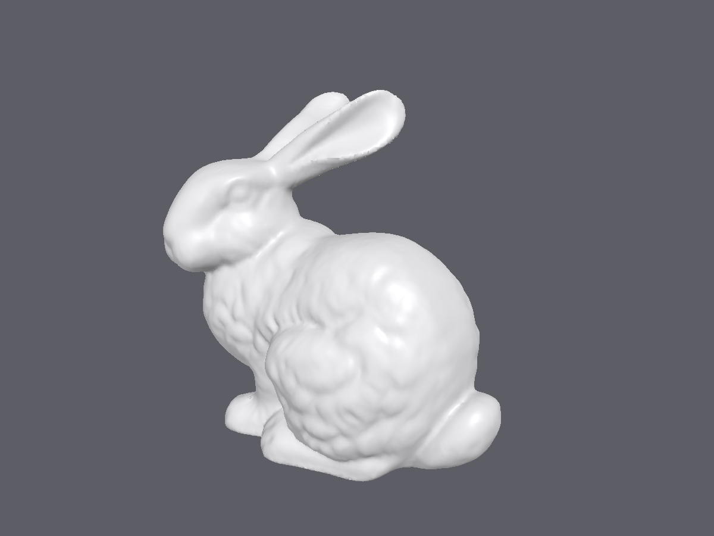
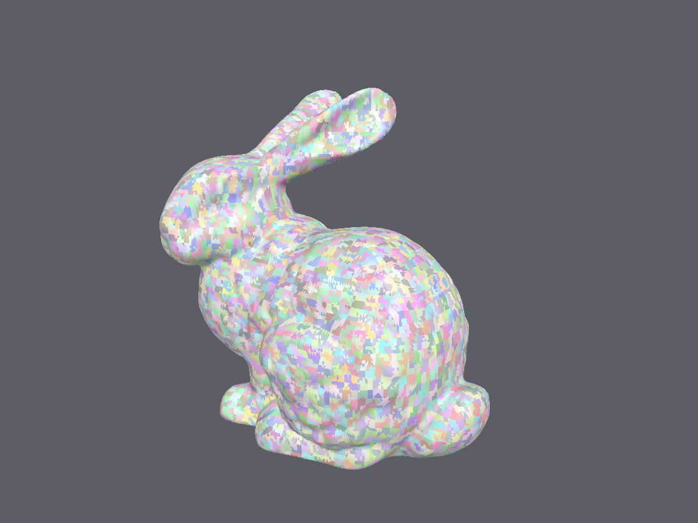
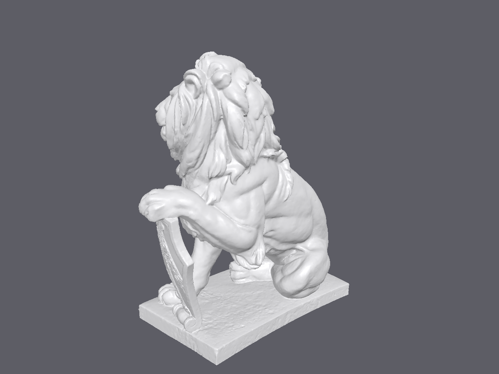
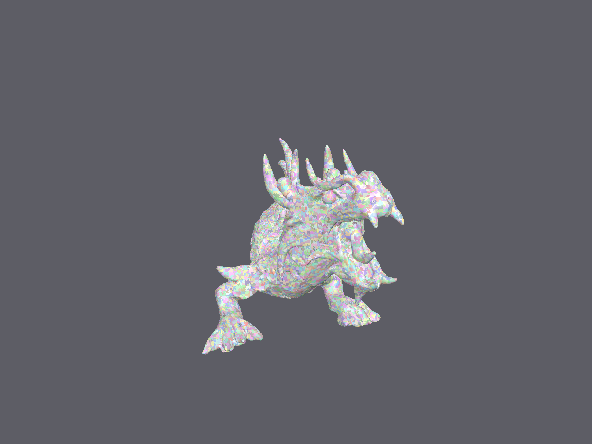
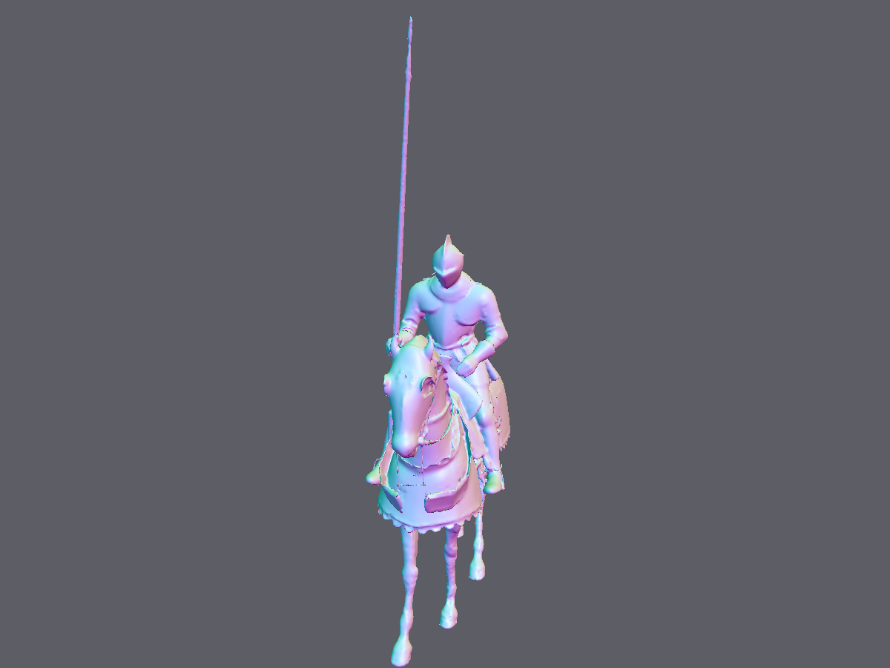
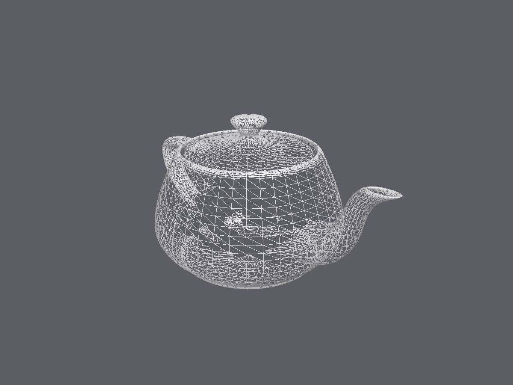

# MetalMesh

Metal 3 **메시 셰이더**(object → mesh → fragment)로 3D 모델을 렌더링하는 iOS / macOS 뷰어입니다.
모델 파일을 CPU에서 메시렛(meshlet)으로 나눠 GPU에 올리고, object 스테이지에서 메시렛 단위 프러스텀·노멀 콘 컬링을 한 뒤
mesh 스테이지가 살아남은 메시렛만 삼각형으로 펼칩니다.

> A SwiftUI + Metal 3 mesh-shader viewer for iOS/macOS. Models are split into meshlets on the CPU,
> culled per-meshlet in the object stage (frustum + normal cone), and expanded in the mesh stage.

| 셰이딩 | 메시렛 시각화 |
|---|---|
|  |  |
|  사자 석상, 49만 삼각형 (CC0, noe-3d.at) |  XYZ RGB Dragon, 25만 삼각형 → 11,900 메시렛 |
|  노멀 디버그 뷰 (Cleveland Museum of Art, CC0) |  와이어프레임 |

이미지는 앱의 렌더러로 오프스크린 렌더링한 결과입니다 (`Tests/SnapshotTests.swift`).

## 기능

- **모델 라이브러리** 화면: 번들 샘플 25개 자동 등록, 파일 임포터·드래그&드롭으로 추가, 재시작 후에도 유지
- **뷰어** 화면: 오빗 카메라(회전/줌/팬), 표시 모드(셰이딩·메시렛 색·노멀), 컬링 토글, 와이어프레임, 라이선스 정보 시트
- 하단 통계: 보이는 메시렛 / 전체 메시렛, 삼각형 수, GPU 프레임 시간
- 지원 포맷: **OBJ, PLY, STL, USD / USDA / USDC / USDZ** (Model I/O)

## 렌더링 파이프라인

```
파일 ──▶ ModelLoader (Model I/O)      삼각형화, 노드 변환 적용, 노멀 생성, Vertex{pos,normal,uv} 48B로 정규화
     ──▶ MeshletBuilder (CPU)         Morton 코드로 삼각형 공간 정렬 → 정점 ≤64 / 삼각형 ≤126 단위로 묶기
                                      메시렛마다 경계 구 + 노멀 콘(meshoptimizer 규약) 계산
     ──▶ GPUMesh                      vertices / meshlets / meshletVertices / meshletTriangles 버퍼
     ──▶ drawMeshThreadgroups
            object 스테이지  스레드 1개 = 메시렛 1개. 프러스텀·콘 컬링 → 살아남은 인덱스를 페이로드에 압축
                             set_threadgroups_per_grid(살아남은 수), atomic 카운터로 통계
            mesh 스테이지    스레드그룹 1개 = 메시렛 1개. set_vertex / set_index / set_primitive(meshletID)
            fragment         2광원 + 스펙큘러, 디버그 모드별 색상
```

Swift와 MSL은 `MetalMesh/Rendering/Shaders/ShaderTypes.h` 한 파일에서 `Vertex`, `Meshlet`, `Uniforms`, 버퍼 인덱스를 공유합니다.
레이아웃은 `Tests/ShaderTypesTests.swift`가 고정합니다.

## 요구 사항

| 항목 | 값 |
|---|---|
| Xcode | 16 이상 (Xcode 26.6에서 개발) |
| 배포 타깃 | iOS 17 / macOS 14 |
| GPU | Metal 3 + Apple7 패밀리 이상 (A14 / M1 이상). iOS 시뮬레이터는 메시 셰이더 미지원 → 안내 화면 표시 |
| 프로젝트 생성 | [XcodeGen](https://github.com/yonaskolb/XcodeGen) (`brew install xcodegen`) |

## 빌드

```bash
brew install xcodegen
xcodegen generate            # MetalMesh.xcodeproj 생성 (.xcodeproj는 커밋하지 않음)
open MetalMesh.xcodeproj
```

`project.yml`의 `DEVELOPMENT_TEAM`을 본인 팀으로 바꾸면 실기기에 설치할 수 있습니다.

명령줄:

```bash
# macOS 빌드 + 테스트 (31개)
xcodebuild -project MetalMesh.xcodeproj -scheme MetalMesh -destination 'platform=macOS' \
  -derivedDataPath build/DerivedData test

# iOS 기기용 빌드
xcodebuild -project MetalMesh.xcodeproj -scheme MetalMesh -destination 'generic/platform=iOS' \
  -derivedDataPath build/DerivedData -allowProvisioningUpdates build

# README 스크린샷 재생성 → 테스트 호스트 컨테이너의 tmp/snapshots/ 에 PNG 생성
TEST_RUNNER_METALMESH_SNAPSHOTS=1 xcodebuild ... -only-testing:MetalMeshTests/SnapshotTests test
```

## 조작

| 동작 | macOS | iOS |
|---|---|---|
| 회전 | 드래그 | 한 손가락 드래그 |
| 줌 | 스크롤 휠, 트랙패드 핀치 | 핀치 |
| 팬 | 우클릭 드래그, ⌥ + 드래그 | 두 손가락 드래그 |

## 프로젝트 구조

```
project.yml                     XcodeGen 정의 (iOS/macOS 단일 타깃 + 테스트 타깃)
MetalMesh/
  App/                          진입점, 기기 지원 검사, 미지원 안내
  Library/                      ModelEntry, ModelLibrary(JSON 인덱스 + Documents/Models), 리스트 화면
  Import/                       ModelIOQueue(직렬화), ModelProbe, ModelLoader, MeshletBuilder
  Rendering/                    Renderer, GPUMesh, RenderSettings, Math, Snapshot, Shaders/
  Viewer/                       ModelViewerView, MetalView(제스처), OrbitCamera
  Resources/Samples/            번들 샘플 모델 + 폴더별 LICENSE.txt + MODELS.md
Tests/                          Swift Testing 31개 (레이아웃, 라이브러리, 로더, 메시렛, 오프스크린 렌더)
scripts/probe-model.swift       Model I/O 로드 검증 CLI
.claude/skills/fetch-3d-model/  무료 소스(Poly Haven, Sketchfab, Poly Pizza, GitHub 테스트 메시)에서 모델을 받는 절차
PLAN.md                         단계별 계획과 진행 상태
```

## 알아둘 점

- **libusd 동시 로드 크래시**: Apple의 USD 런타임은 여러 스레드에서 USD 파일을 동시에 처음 열면 크래시합니다
  (`Sdf_GetExtension` 널 포인터). 모든 Model I/O 호출은 `ModelIOQueue` 액터로 직렬화합니다.
- 래스터라이저 컬링은 끄고(`cullMode = .none`) 뒷면 제거는 object 스테이지의 노멀 콘이 담당합니다. 와인딩이 뒤집힌 파일도 보이게 하기 위함입니다.
- 텍스처는 아직 적용하지 않습니다(Poly Haven/Sketchfab 모델은 회색으로 표시). GLB는 Model I/O가 읽지 못해 미지원입니다.

## 로드맵

- [ ] baseColor 텍스처 표시
- [ ] 리스트 썸네일(오프스크린 렌더 재사용)
- [ ] 삼각형 전용 최소 GLB 로더
- [ ] 메시렛 클러스터링 품질 개선(meshoptimizer 방식), LOD
- [ ] iPhone/iPad 실기기 성능 측정

## 샘플 모델 라이선스

번들 모델 25개의 출처와 라이선스는 [`MetalMesh/Resources/Samples/MODELS.md`](MetalMesh/Resources/Samples/MODELS.md)와 각 폴더의 `LICENSE.txt`에 있습니다.
Stanford 스캔 모델은 비상업·출처 표기 조건, Sketchfab의 CC BY 모델(Laocoön by rigsters, Egyptian Cat by Ankledot, Skull by martinjario)은 작성자 표기 조건입니다.
Poly Haven 모델과 Sketchfab CC0 모델은 CC0입니다.

## 라이선스

소스 코드는 [MIT](LICENSE)입니다. 샘플 모델은 위 개별 라이선스를 따릅니다.
